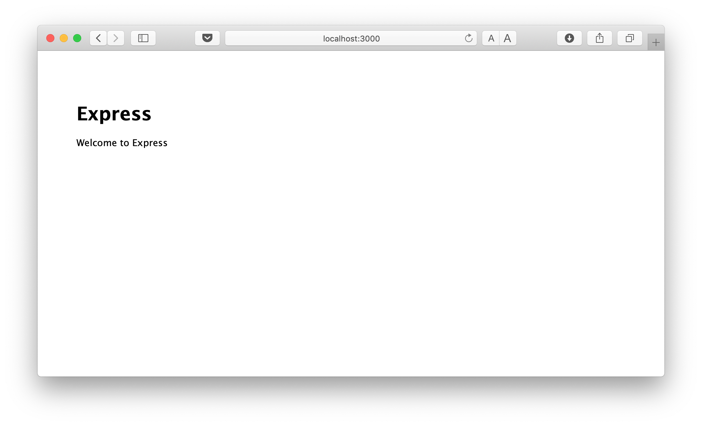
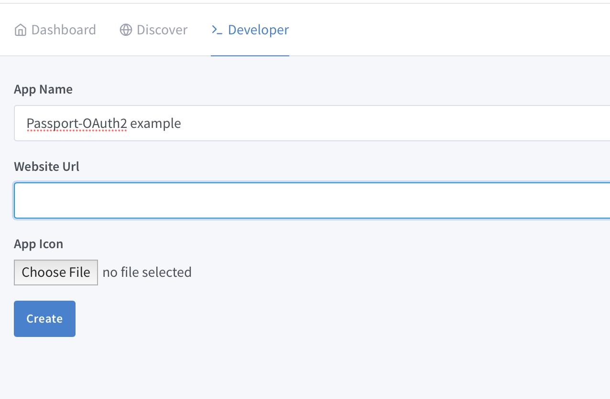
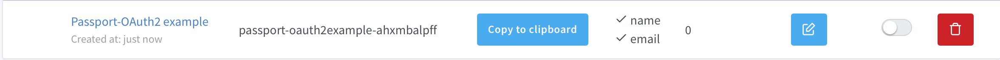
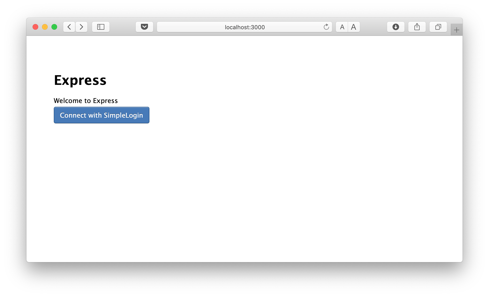
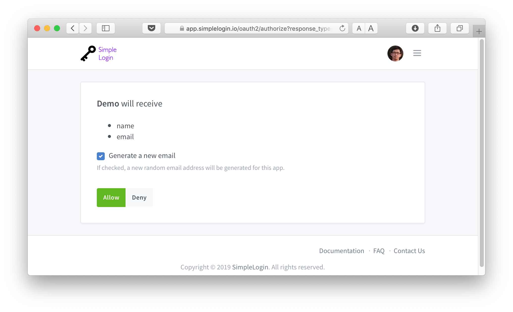
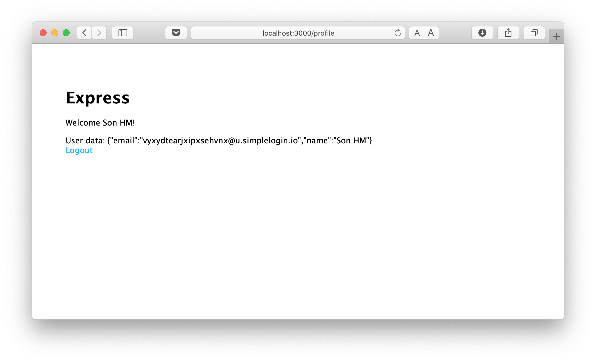

This is an example on how to integrate [SimpleLogin](https://simplelogin.io) with [passportjs](http://www.passportjs.org), a  popular authentication middleware for NodeJS. 

This example is inspired a lot from a similar guide from [Okta](https://developer.okta.com/blog/2018/05/18/node-authentication-with-passport-and-oidc).

You can run the code by jumping into [step 2](#Step-2-SimpleLogin-OAuth2-credentials) directly to obtain the OAuth2 `client_id` and `client_secret`. Then you can run the code by 

```bash
npm install
npm run
```

then open [demo](http://localhost:3000). 

Below is the detailed steps that can be useful if you want to add SimpleLogin into a existing project. As SimpleLogin follows OAuth2 protocol, this guide can also be used as a introduction on how to use `passportjs` with OAuth2 :). 

## Step 1: bootstrap

Install [express-generator](https://expressjs.com/en/starter/generator.html) to bootstrap our example:

> npm install express-generator -g

Init the project using `express-generator`:

> express -e --git passport-oauth2-example

Let's make sure that the bootstrap code is running correctly:

> npm install && npm start

Now [localhost:3000](http://localhost:3000) should show this quite empty page




## Step 2: SimpleLogin OAuth2 credentials 

For **OAuth2 Authorization Code Grant Type** (what a mouthful!), you need a `client_id` and `client_secret`. In case you need to refresh the memory, we recommend [this article](https://developer.okta.com/blog/2018/04/10/oauth-authorization-code-grant-type) that explains quite well OAuth2 Code Grant Type.

- First please head to [SimpleLogin](http://app.simplelogin.io) and create an account if you do not have one already.

- Create a new app in **Developer** tab:

You can leave the *website url* and *app icon* empty for this example project.

- Copy the client-id and client-secret


- Store the credential as environment variables. They will be used later in our example.

```bash
export CLIENT_ID={your_client_id}
export CLIENT_SECRET={your_client_secret}
```

## Step 3: Install `passportjs` and integrate SimpleLogin

To store user information in the session, `passportjs` uses `express-session`. After obtaining the `access_token`, we also need to call `/userinfo` endpoint so let's also add `axios`:

> npm install express-session@1.16.2 passport@0.4.0 passport-oauth@1.0.0 axios@0.19.0 --save


Setup `express-session` by adding the following lines into `app.js`, just above the 
`var app = express();` line.

```js
app.use(session({
  secret: 'my-precious',
  resave: false,
  saveUninitialized: true
}));
```

Add the following lines just below the `app.use(express.static(path.join(__dirname, 'public')));` to tell `express` to use `passportjs` for sessions:

```
app.use(passport.initialize());
app.use(passport.session());
```

We also need tell `passportjs` how to serialize/deserialize user to/from session:

```js
passport.serializeUser((user, next) => {
  next(null, user);
});

passport.deserializeUser((obj, next) => {
  next(null, obj);
});
```

Phew, all setup with `passportjs` finally done! Finally it's time to integrate SimpleLogin!

Config `passportjs` to use SimpleLogin `authorization` and `token` URL and obtain user information once we have the `accessToken`:

```js
passport.use('oauth2', new OAuth2Strategy({
  authorizationURL: 'https://app.simplelogin.io/oauth2/authorize',
  tokenURL: 'https://app.simplelogin.io/oauth2/token',
  clientID: process.env.CLIENT_ID,
  clientSecret: process.env.CLIENT_SECRET,
  callbackURL: 'http://localhost:3000/authorization-code/callback'
},
  function (accessToken, refreshToken, profile, done) {
    // with accessToken, we can obtain user information 
    // by calling the `userinfo` endpoint
    axios({
      method: 'get',
      url: 'https://app.simplelogin.io/oauth2/userinfo',
      headers: {
        Authorization: accessToken
      }
    }).then(res => {
      console.log(res);
      var user = { email: res.data.email, name: res.data.name };
      done(null, user);
    }).catch(err => {
      console.log("error:", err);
    })
  }
));
```

When user logs in at `/login`, let's call `passportjs`:

```js
// call passport when user logs in
app.use('/login', passport.authenticate('oauth2'));
```

We also need to setup the callback route that is called when user authorizes this application on SimpleLogin. This is the second step in *OAuth2 Authorization Code Grant Type* flow.

```js
// Once user authorizes this client, the browser will redirect him/her back to this route. This route the `callbackURL` when we setup passport
app.use('/authorization-code/callback',
  passport.authenticate('oauth2', { 
    successRedirect: '/profile',
    failureRedirect: '/login', 
    failureFlash: true 
  })
);
```

## Step 4: A simple login/logout

Let's create a quick profile page to display user data that we obtain from SimpleLogin. 
First create a `profile.ejs` file inside `views/`:

```html
<!DOCTYPE html>
<html>
  <head>
    <title><%= title %></title>
    <link rel='stylesheet' href='/stylesheets/style.css' />
  </head>
  <body>
    <h1><%= title %></h1>
    <p>Welcome <%= user.name %>!</p>
    <div>User data: <%= JSON.stringify(user) %></div>
    <a href="/logout">Logout</a>
    
  </body>
</html>
```

Also add the login button to the home page by adding this line into `index.ejs` file:

```html
<a href="/login">Connect with SimpleLogin</a>
```

Then create routes for this page and the `/logout` route:

```js
// Redirect user to /login if user accidentally goes to /profile route
function ensureLoggedIn(req, res, next) {
  if (req.isAuthenticated()) {
    return next();
  }

  res.redirect('/login')
}

app.use('/profile', ensureLoggedIn, (req, res) => {
  res.render('profile', { title: 'Express', user: req.user });
});

// logout consists of simply emptying the session
app.get('/logout', (req, res) => {
  req.logout();
  req.session.destroy();
  res.redirect('/');
});
```

## Profit!

Now if you run the server again with `npm start` and go to http://localhost:3000, you should see this screen: 



Clicking on **Connect with SimpleLogin** button will bring you to the authorization page on SimpleLogin:



Clicking on **Allow** bring user back to the local website and display user information obtained from SimpleLogin:



Congratulations, you just integrated SimpleLogin OAuth2 Authorization Code Grant Type!


